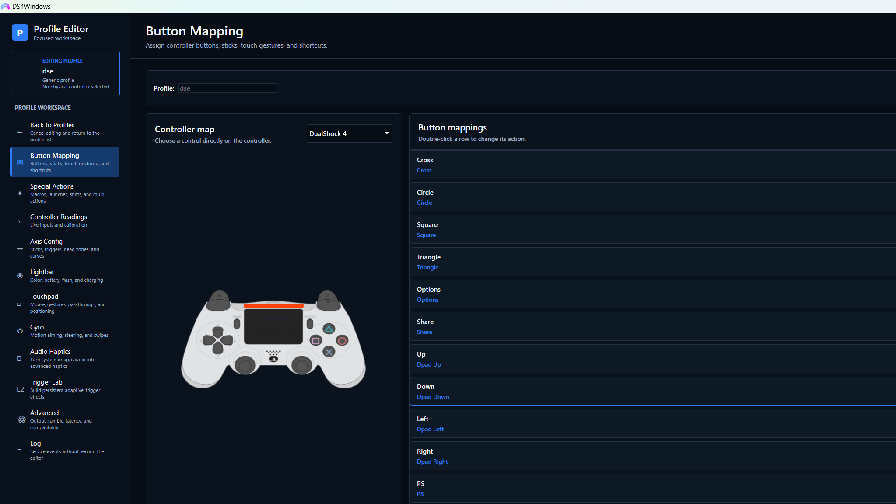
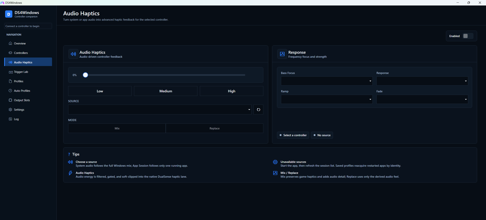

# DS4Windows

DS4Windows is a Windows controller mapper maintained by hbashton. It reads
supported PlayStation and Nintendo controllers, applies per-profile mappings,
and presents the output expected by games. This fork continues the work of
Jays2Kings, Ryochan7, Schmaldeo, and the wider DS4Windows community.

This is the hbashton fork. Downloads, update checks, bug reports, and VIIPER
integration documented here all refer to hbashton repositories.

## UI preview

## Download and install

### Stable release

Most users should start with the stable build.

1. Open the [latest stable release](https://github.com/hbashton/DS4Windows/releases/latest).
2. Download `DS4Windows_<version>_x64.zip`. This VIIPER-based fork supports x64 Windows only.
3. Extract the entire `DS4Windows` folder to a permanent location such as
   `%LOCALAPPDATA%\DS4Windows` or `C:\Tools\DS4Windows`.
4. Run `DS4Windows.exe`. Do not run it from inside the ZIP archive.
5. Complete the first-run driver prompts, connect a controller, and select or create a profile.

For a one-file stable installer, download and run
[`ds4w.bat`](https://raw.githubusercontent.com/hbashton/DS4Windows/main/ds4w.bat).
It installs the latest stable hbashton release to `%LOCALAPPDATA%\DS4Windows`
and creates a desktop shortcut.

### DualSense and VIIPER preview

Native virtual DualSense output, advanced haptics, controller audio, and
microphone support are being released as VIIPER preview builds. These builds
appear as pre-releases on the
[DS4Windows Releases page](https://github.com/hbashton/DS4Windows/releases).
Choose the newest release whose tag begins with `VIIPER` when you want these
features.

> **VIIPER is x64 only.** VIIPER releases do not work with x86 Windows or the
> x86 DS4Windows build. Install the x64 DS4Windows package on a 64-bit Windows
> system before enabling any VIIPER output profile.

After installing a VIIPER-capable DS4Windows build:

1. Open **Settings**.
2. Under **VIIPER Virtual Controller Support**, click **Install / Repair VIIPER**.
3. Accept the administrator prompt. The setup installs the hbashton VIIPER
   backend and the required `usbip-win2` driver.
4. Restart Windows if the setup installed or updated `usbip-win2`.
5. Edit a profile and select **DualSense**, **DualSense Edge**, **DualShock 4**,
   **Xbox 360**, or **Switch 2 Pro**. VIIPER is the backend for every virtual
   controller type; it is not repeated in the device names.

The installer also registers a hidden `RunVIIPER` task at sign-in. It starts
the backend elevated without a recurring console or UAC popup. DS4Windows
checks the backend at startup, starts it when possible, and opens a guided,
self-elevating repair flow when VIIPER or usbip-win2 is missing.

The matching VIIPER backend is published at
[hbashton/VIIPER](https://github.com/hbashton/VIIPER). Use DS4Windows' built-in
installer when possible so the backend and driver are placed and started
correctly.

## What this fork adds

### Profiles and automation

- Window-title-only Auto Profile rules for applications that do not expose a usable executable path.
- Duplicate Auto Profile rules with per-device matching for DualSense, DS4, DS3, Switch Pro, and Joy-Con controllers.
- An apply-to-all-controllers option for Auto Profiles.
- Xbox Game Bar profile switching with Game Bar priority over normal Auto Profiles while the overlay is visible.
- Per-profile Game Bar compatibility for VIIPER DualSense outputs, using a temporary
  XInput companion only while the overlay is visible without changing the loaded profile.
- Per-profile DualSense adaptive-trigger configuration and fixed full-pull trigger actions.
- More reliable profile transitions, including duplicate-rule crash and profile-switch latency fixes.
- Profile and Auto Profile search with live filtering and one-click clearing.
- Profile-scoped Audio Haptics and Trigger Lab settings.

### Controller output

- VIIPER virtual Xbox 360, DualShock 4, DualSense, DualSense Edge, and Switch 2 Pro output.
- Automatic migration of old Xbox 360 and DualShock 4 output selections to
  their VIIPER equivalents; ViGEmBus is not required.
- Native-style DualSense buttons, sticks, triggers, touch, gyro, accelerometer,
  lightbar, player LEDs, mute button, and Edge controls through VIIPER.
- Adaptive-trigger feedback forwarded from games to a physical DualSense or DualSense Edge.
- Advanced DualSense haptics transported from the virtual USB audio interface to a physical Bluetooth controller.
- Audio Haptics can capture the full system mix, an emulated-controller audio
  endpoint, or one selected running app (including its child processes) and
  turn it into profile-controlled DualSense haptic feedback.

### PlayStation controller audio

VIIPER preview builds expose Windows audio interfaces that match the virtual
DualSense or DualShock 4 selected by the profile. Supported paths include:

- Game or desktop audio sent to a physical DualSense or DualShock 4 speaker over
  Bluetooth, even when the emulated Sony controller is the other model.
- A virtual recording endpoint fed by the physical DualSense or DualShock 4
  microphone, with automatic conversion to the emulated controller's native
  capture format.
- Microphone level and noise-suppression controls.
- A profile option that lets the DualSense mute button mute and restore the
  microphone while keeping the recording stream active.

Audio, microphone, and advanced-haptics support require matching DS4Windows and
VIIPER preview builds. They are not part of the current stable 4.0.2.x backend.

### Quality of life

- Automatic HidHide management for connected controllers, with per-profile
  control where direct passthrough is required.
- Improved long-path handling in Auto Profiles.
- Game Bar installation/elevation guidance and safer visibility detection.
- Update checks and updater downloads pointed at hbashton releases.
- Optional verbose logging and VIIPER diagnostics in preview builds.

## Requirements

- Windows 10 or Windows 11. VIIPER requires Windows x64 and the x64 DS4Windows build; x86 is not compatible with VIIPER.
- [Microsoft .NET 8 Desktop Runtime](https://dotnet.microsoft.com/en-us/download/dotnet/8.0).
- [Microsoft Visual C++ 2015-2022 Redistributable](https://aka.ms/vs/17/release/vc_redist.x64.exe).
- [HidHide](https://github.com/nefarius/HidHide) strongly recommended to prevent games from seeing both the physical and virtual controller.
- `usbip-win2` and [hbashton/VIIPER](https://github.com/hbashton/VIIPER), installed through the built-in guided setup.

Supported physical inputs include first-party DualShock 4, DualSense,
DualSense Edge, DualShock 3, Switch Pro, and Joy-Con controllers. Some compatible
third-party and streamed virtual controllers are also supported when their HID
reports match a supported device type.

Moonlight/Sunshine virtual controllers are accepted when the corresponding
Device Options setting is enabled and Sunshine is running. DS4Windows still
rejects its own VIIPER outputs to prevent recursive virtual controllers.

## First setup

1. Install the required drivers when DS4Windows prompts for them.
2. In **Settings > Device Options**, enable any additional controller families you intend to use.
3. Connect the controller by USB or Bluetooth.
4. Create a profile or apply a preset.
5. Keep **Hide DS4 Controller** enabled when a game would otherwise see both the real and virtual devices.
6. Disable overlapping PlayStation or Xbox remapping in Steam for games managed entirely by DS4Windows.

Xbox Game Bar profile support requires DS4Windows to run elevated. VIIPER and
HidHide setup may also require administrator approval.

## Updating

The in-app update check reads releases from
[hbashton/DS4Windows](https://github.com/hbashton/DS4Windows/releases). Stable
builds do not automatically install prereleases.

For a manual update:

1. Close DS4Windows.
2. Extract the new release over the application folder.
3. Start DS4Windows again.

Profiles and logs are stored separately under `%APPDATA%\DS4Windows`, so
replacing the application folder does not normally remove user profiles. When
updating a VIIPER preview, run **Install / Repair VIIPER** again if the release
notes call for a matching backend update.

## Troubleshooting

- **A game receives double input:** install or repair HidHide, run DS4Windows as
  administrator, and confirm the physical controller is hidden while the
  virtual controller remains visible.
- **A VIIPER profile will not create an output:** open **Settings**, refresh the
  VIIPER status, run **Install / Repair VIIPER**, and reboot once if
  `usbip-win2` was installed.
- **Controller speaker or microphone is missing:** confirm you are using matching
  DS4Windows and VIIPER preview releases and that the profile uses a VIIPER
  DualSense, DualSense Edge, or DualShock 4 output.
- **Game Bar does not switch profiles:** install or repair Xbox Game Bar and run
  DS4Windows as administrator.
- **More diagnostics are needed:** enable **Verbose logging**, reproduce the
  issue once, and attach `%APPDATA%\DS4Windows\Logs\ds4windows_log.txt` to the
  bug report.

Report bugs at [hbashton/DS4Windows Issues](https://github.com/hbashton/DS4Windows/issues).

If this work is useful, you can [support continued development through
PayPal](https://www.paypal.com/paypalme/hbashton).

## Development

The solution targets .NET 8 and publishes x64 GitHub Actions builds. Pull
requests should keep stable behavior intact when adding preview backends and
should include focused tests for profile persistence, controller state, or
transport changes where practical.

## License

DS4Windows is licensed under the GNU General Public License version 3. See
[`COPYING`](COPYING) for the complete license text.

## Credits

This fork exists because of the work of Jays2Kings, Ryochan7, Schmaldeo, the
DS4Windows contributors, Nefarius and the HidHide project, the VIIPER
project, `usbip-win2`, and the controller-protocol research shared by the wider
community.
