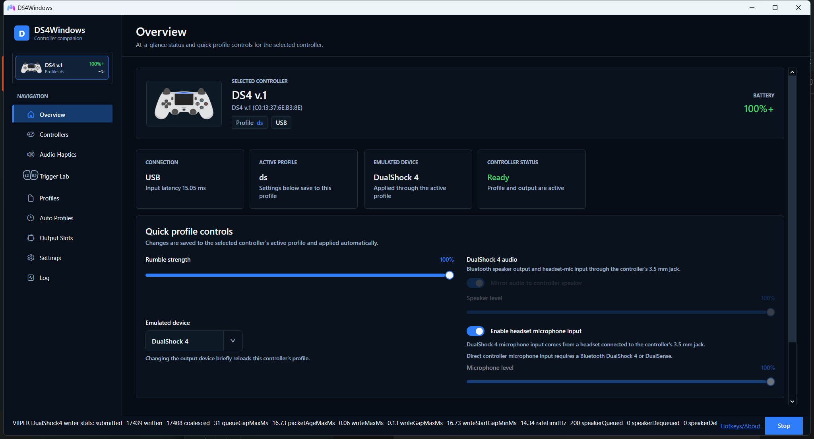
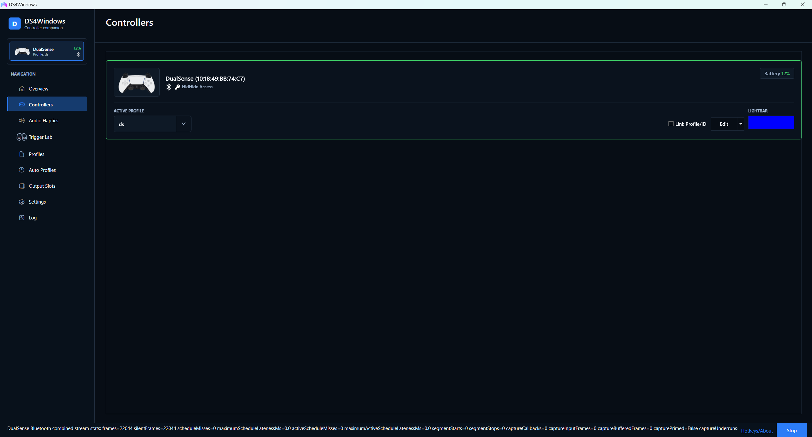
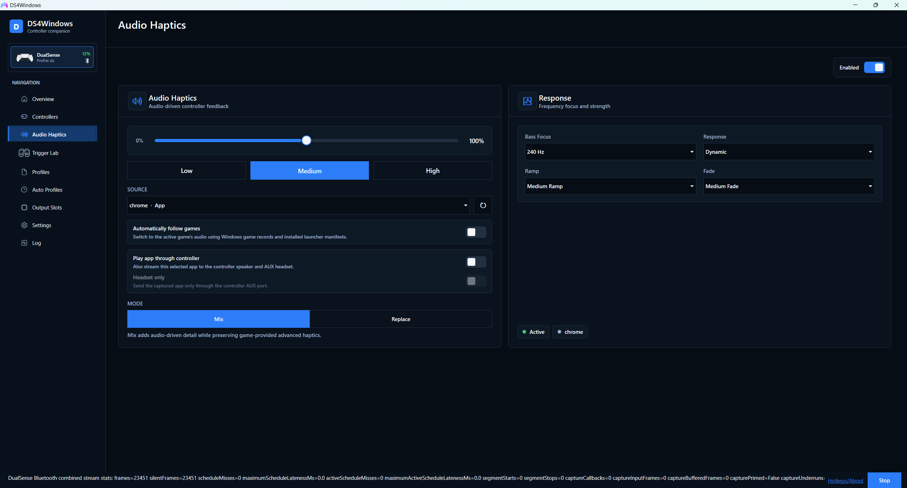
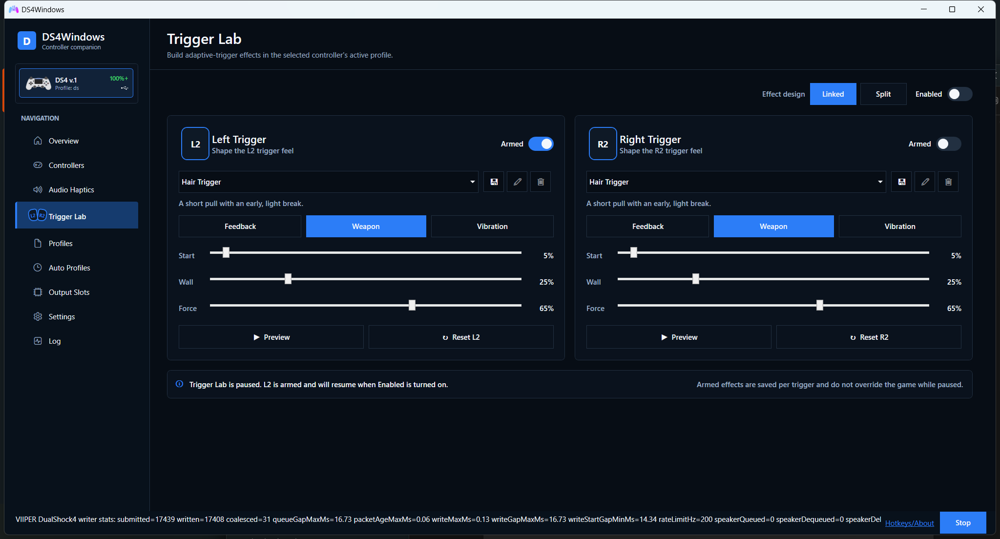
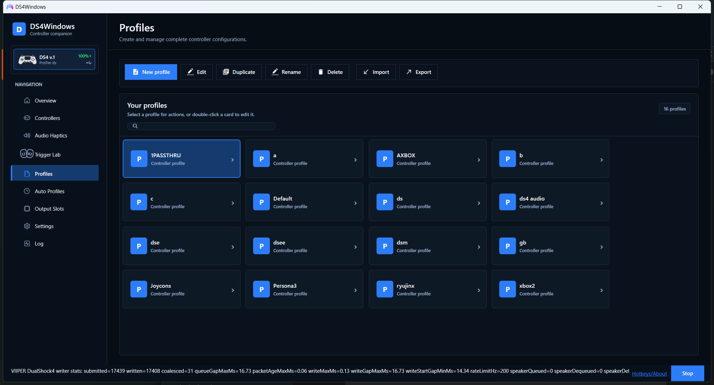
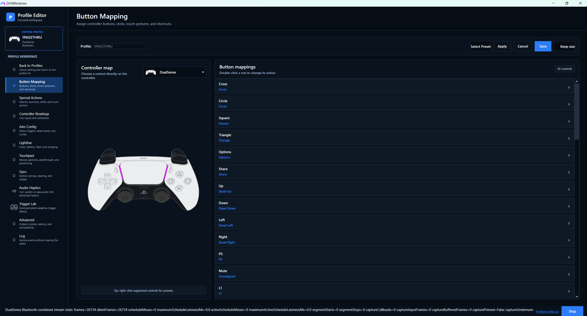
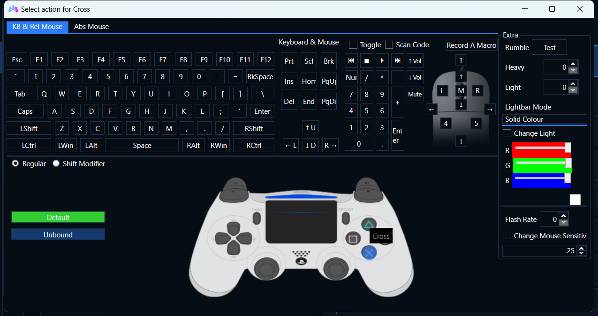
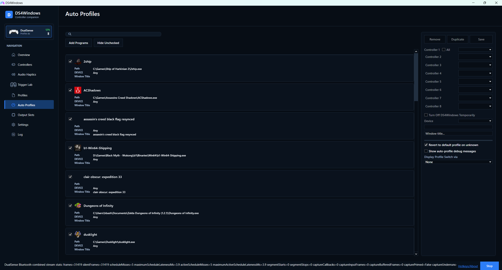
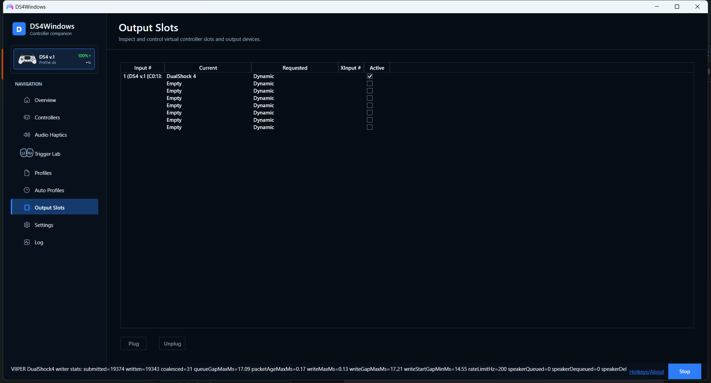
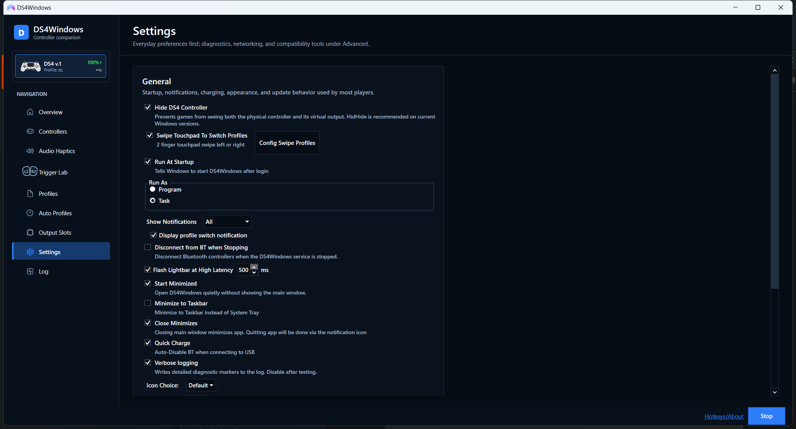

# DS4Windows 5

### Your controller. Your profile. Every game.

Modern remapping, virtual controllers, PlayStation audio, adaptive triggers,
advanced haptics, and controller-aware automation in one low-latency Windows app.

DS4Windows reads supported PlayStation and Nintendo controllers, applies a
profile in real time, and presents the virtual device a game expects. Version 5
combines the complete mapper with a redesigned interface and the VIIPER virtual
controller backend.

| What you get | Why it matters |
|---|---|
| **One profile, any output** | Emulate Xbox 360, DualShock 4, DualSense, DualSense Edge, or Switch 2 Pro without giving up physical-controller features. |
| **PlayStation audio over Bluetooth** | Route a selected app or the default Windows mix to the controller speaker or AUX port, and expose the controller microphone to Windows. |
| **Audio Haptics + native game feedback** | Convert system or per-app audio into DualSense haptics, or mix it with the game's own advanced feedback. |
| **Trigger Lab** | Design, preview, and save independent L2/R2 effects directly in each profile. |
| **Controller-accurate remapping** | Work from the controller you have and the virtual controller the game will see. |
| **Automation without input stalls** | Searchable profiles, Auto Profiles, Game Bar support, and asynchronous profile changes keep input responsive. |

This hbashton fork continues the work of Jays2Kings, Ryochan7, Schmaldeo, and
the wider DS4Windows community. Downloads, update checks, support links, and
VIIPER integration on this page refer to the hbashton repositories.

## Download and install

### Standard installer — recommended

Most users should download `DS4Windows_5.0.3.0_Setup_x64.exe` from the
[newest release candidate](https://github.com/hbashton/DS4Windows/releases). The
single offline installer:

- installs DS4Windows and VIIPER under `%ProgramFiles%\DS4Windows`;
- verifies and installs USB-IP 0.9.7.7 only when required;
- offers optional HidHide and FakerInput checkboxes;
- creates a desktop shortcut by default; and
- detects install, update, repair, and restart/resume scenarios automatically.

The installer requests administrator permission once and contains every
required payload; it does not open a command window or download dependencies.

### Portable ZIP

Portable users can instead download `DS4Windows_VIIPER_x64.zip`, extract the
entire `DS4Windows` folder to a permanent writable location, and run
`DS4Windows.exe`. Do not run it from inside the ZIP archive. The standard
installer itself intentionally does not expose a portable mode or destination
selector.

### DS4Windows 5 release candidates

DS4Windows 5 release candidates include virtual DualSense output, advanced
haptics, controller audio, microphone capture, and the redesigned interface.
Release Candidate 4.1, **Bugfixes and Lower-Latency Audio/Vibration**, lowers
input and feedback latency, improves per-app audio recovery, fixes profile and
rumble races, and hardens the all-in-one installer while retaining RC4's native
game feedback and cross-output features.
They appear as pre-releases on the
[DS4Windows Releases page](https://github.com/hbashton/DS4Windows/releases).
Choose the newest release-candidate build when you want to test these features.

> **VIIPER is x64 only.** VIIPER releases do not work with x86 Windows or the
> x86 DS4Windows build. Install the x64 DS4Windows package on a 64-bit Windows
> system before enabling any VIIPER output profile.

After installing a VIIPER-capable DS4Windows build:

1. Open **Settings**.
2. Under **VIIPER Virtual Controller Support**, click **Install / Repair VIIPER**.
3. Accept the administrator prompt from an administrator account. The setup
   installs the hbashton VIIPER backend and the required `usbip-win2` driver;
   alternate administrator credentials are not used to create another user's
   startup tasks.
4. Restart Windows if the setup installed or updated `usbip-win2`.
5. Edit a profile and select **DualSense**, **DualSense Edge**, **DualShock 4**,
   **Xbox 360**, or **Switch 2 Pro**. VIIPER is the backend for every virtual
   controller type; it is not repeated in the device names.

When **Run at Startup** is enabled, setup registers and verifies the
highest-privilege `RunVIIPER` and `RunDS4Windows` sign-in tasks before a driver
step can require a restart. When the setting is disabled, setup removes both
tasks and performs only the requested one-time launch. This policy is preserved
across standard and portable repairs without recurring console or UAC popups.
DS4Windows checks the backend at startup and
opens a guided, self-elevating repair flow when VIIPER or usbip-win2 is missing.
The release ZIP is a complete offline setup bundle: VIIPER, usbip-win2,
HidHide, FakerInput, and the .NET runtime are packaged together. Setup never
downloads a replacement dependency; package composition fails if one is
missing, and the VIIPER checksum is generated from the exact bundled binary.
Setup copies DS4Windows and VIIPER into the dedicated
`%ProgramFiles%\DS4Windows` application tree and protects the managed VIIPER
task target and recovery copy from unelevated replacement. It never changes permissions on the folder
where a user happened to extract the ZIP, so Desktop and Downloads contents
remain untouched. Opening a different portable DS4Windows copy later keeps that
copy portable and, after one administrator confirmation, retargets the existing
`RunDS4Windows` task to the copy the user deliberately opened.

For portable users, the `RunDS4Windows` task created during Install / Repair
points to the exact portable executable that launched setup. The Program Files
copy is still refreshed for managed installation and recovery, but it does not
silently take ownership of that portable user's startup choice.

The matching VIIPER backend is published at
[hbashton/VIIPER](https://github.com/hbashton/VIIPER). Use DS4Windows' built-in
installer when possible so the backend and driver are placed and started
correctly.

## Why DS4Windows 5 is different

### Profiles and automation

- Window-title-only Auto Profile rules for applications that do not expose a usable executable path.
- Duplicate Auto Profile rules with per-device matching for DualSense, DS4, DS3, Switch Pro, and Joy-Con controllers.
- An apply-to-all-controllers option for Auto Profiles.
- Per-profile Game Bar compatibility for DualSense outputs. It uses a
  temporary XInput companion only while the overlay is visible and does not
  change the loaded profile.
- Per-profile DualSense adaptive-trigger configuration and fixed full-pull trigger actions.
- More reliable profile transitions, including duplicate-rule crash and profile-switch latency fixes.
- Profile and Auto Profile search with live filtering and one-click clearing.
- Profile-scoped Audio Haptics and Trigger Lab settings.

### Controller output

- VIIPER virtual Xbox 360, DualShock 4, DualSense, DualSense Edge, and Switch 2 Pro output.
- Automatic migration of old Xbox 360 and DualShock 4 output selections to
  their VIIPER equivalents; ViGEmBus is not required.
- Native-style DualSense buttons, sticks, triggers, touch, gyro, accelerometer,
  lightbar, player LEDs, mute button, and Edge controls through VIIPER.
- Adaptive-trigger feedback forwarded from games to a physical DualSense or DualSense Edge.
- Advanced DualSense haptics transported from the virtual USB audio interface to a physical Bluetooth controller.
- Audio Haptics can capture the full system mix, an emulated-controller audio
  endpoint, or one selected running app (including its child processes) and
  turn it into profile-controlled DualSense haptic feedback.

### PlayStation controller audio

VIIPER preview builds expose Windows audio interfaces that match the virtual
DualSense or DualShock 4 selected by the profile. Supported paths include:

- Game, desktop, or selected-app audio sent to a physical DualSense or
  DualShock 4 speaker over Bluetooth, even while emulating Xbox, Switch, or the
  other PlayStation model.
- Separate speaker and headset-only modes with independent volume controls,
  clean AUX switching, and automatic recovery after profile changes,
  controller reconnects, or DS4Windows service restarts.
- One persistent playback/recording endpoint per physical controller, avoiding
  endpoint churn when the profile changes its emulated output.
- A virtual recording endpoint fed by the physical DualSense or DualShock 4
  microphone, with automatic conversion to the emulated controller's native
  capture format.
- Microphone level and noise-suppression controls.
- A profile option that lets the DualSense mute button mute and restore the
  microphone while keeping the recording stream active.

Audio, microphone, and advanced haptics support require matching DS4Windows 5
and VIIPER 0.1.1 builds.

### Quality of life

- Automatic HidHide management for connected controllers, with per-profile
  control where direct passthrough is required.
- Improved long-path handling in Auto Profiles.
- Game Bar installation/elevation guidance and safer visibility detection.
- Update checks and updater downloads pointed at hbashton releases.
- Optional verbose logging and VIIPER diagnostics in preview builds.

## Interface tour

The redesigned interface keeps everyday controls easy to reach while preserving
the complete DS4Windows feature set for advanced users.

### Overview

Choose a connected controller and see its battery, connection, active profile,
emulated device, and output status at a glance. Quick profile controls let you
adjust rumble, output type, speaker routing, and microphone input without opening
the full profile editor.

  

### Controllers

Manage every connected controller from one screen. Each device card exposes its
active profile, HidHide state, battery level, lightbar color, and profile-linking
controls.

  

### Audio Haptics

Turn the system mix, an emulated-controller endpoint, or one running app into
DualSense haptic feedback. Choose the source, strength, response curve, frequency
focus, ramp, fade, and whether the generated feedback mixes with or replaces
native game haptics.

  

### Trigger Lab

Build persistent adaptive-trigger effects for the active profile. Start with a
ready-made effect, tune its mode, start point, wall, and force, then preview it
before saving. L2 and R2 can be armed independently; **Linked** shares one effect
design, while **Split** restores separate settings for each trigger.

  

### Profiles

Search, create, duplicate, rename, import, export, or delete controller profiles.
Profile cards provide a clear overview and open directly into the focused editor.

  

### Profile editor and button mapping

Editing a profile opens a dedicated workspace for button mapping, special
actions, controller readings, axis curves, lighting, touchpad behavior, gyro,
Audio Haptics, Trigger Lab, and advanced settings. The controller map defaults
to the selected physical controller and can be changed without altering the
profile's emulated output.

  

### Remapping dialog

Assign keyboard, mouse, media, macro, or virtual-controller actions. The diagram
matches the profile's emulated controller, and hovering a control highlights the
exact button target directly on the controller.

  

### Auto Profiles

Switch profiles automatically by executable path, window title, or controller.
Live search filters rules as you type, while the detail panel controls per-device
assignments, temporary controller shutdown, and fallback behavior.

  

### Output Slots

Inspect the relationship between input controllers and virtual output devices.
The slot table shows the current and requested output modes and supports manual
plugging or unplugging when a fixed slot layout is needed.

  

### Settings

Common startup, notification, charging, appearance, and update options stay in
the main Settings view. Diagnostic, networking, compatibility, device-support,
and backend tools remain available under the advanced sections.

  

## Requirements

- Windows 10 or Windows 11. VIIPER requires 64-bit Windows and the x64
  DS4Windows build. It is not compatible with x86 Windows.
- [Microsoft Visual C++ 2015-2022 Redistributable](https://aka.ms/vs/17/release/vc_redist.x64.exe).
- [HidHide](https://github.com/nefarius/HidHide) is strongly recommended to
  prevent games from seeing both the physical and virtual controllers. The
  pinned HidHide installer is included in the DS4Windows package, so first-run
  HidHide setup does not need to download it.
- `usbip-win2` and [hbashton/VIIPER](https://github.com/hbashton/VIIPER),
  bundled with DS4Windows and installed through the built-in guided setup.
- FakerInput is optional. Its runtime bridge DLLs and pinned x64/x86 driver
  installers ship with DS4Windows, so its first-run driver setup works offline.

GitHub CI and release ZIPs include the x64 .NET 8 runtime and do not require a
separate .NET installation. The Visual C++ runtime remains a system
prerequisite and is not included in the DS4Windows ZIP.

Supported physical inputs include first-party DualShock 4, DualSense,
DualSense Edge, DualShock 3, Switch Pro, and Joy-Con controllers. Some compatible
third-party and streamed virtual controllers are also supported when their HID
reports match a supported device type.

Moonlight/Sunshine virtual controllers are accepted when the corresponding
Device Options setting is enabled and Sunshine is running. DS4Windows still
rejects its own VIIPER outputs to prevent recursive virtual controllers.

## First setup

1. Install the required drivers when DS4Windows prompts for them.
2. In **Settings > Device Options**, enable any additional controller families you intend to use.
3. Connect the controller by USB or Bluetooth.
4. Create a profile or apply a preset.
5. Keep **Use HidHide to Prevent Double Input** enabled when a game would otherwise see both the real and virtual devices.
6. Disable overlapping PlayStation or Xbox remapping in Steam for games managed entirely by DS4Windows.

Xbox Game Bar companion support requires DS4Windows to run elevated. VIIPER and
HidHide setup may also require administrator approval.

## Updating

The in-app update check reads releases from
[hbashton/DS4Windows](https://github.com/hbashton/DS4Windows/releases). Stable
builds do not automatically install prereleases.

For a manual update:

1. Close DS4Windows.
2. Extract the new release over the application folder.
3. Start DS4Windows again. Opening a portable copy automatically offers to
   retarget the existing startup task to that copy. Run **Install / Repair
   VIIPER** only when the app reports that its managed backend needs repair.

Profiles and logs are stored separately under `%APPDATA%\DS4Windows`, so
replacing the application folder does not normally remove user profiles. When
updating a VIIPER preview, run **Install / Repair VIIPER** again if the release
notes call for a matching backend update.

## Troubleshooting

- **A game receives double input:** install or repair HidHide, run DS4Windows as
  administrator, and confirm the physical controller is hidden while the
  virtual controller remains visible.
- **A VIIPER profile will not create an output:** open **Settings**, refresh the
  VIIPER status, run **Install / Repair VIIPER**, and reboot once if
  `usbip-win2` was installed.
- **Controller speaker or microphone is missing:** confirm you are using matching
  DS4Windows and VIIPER preview releases and that the profile uses a VIIPER
  DualSense, DualSense Edge, or DualShock 4 output.
- **Game Bar does not switch profiles:** install or repair Xbox Game Bar and run
  DS4Windows as administrator.
- **More diagnostics are needed:** enable **Verbose logging**, reproduce the
  issue once, and attach `%APPDATA%\DS4Windows\Logs\ds4windows_log.txt` to the
  bug report.

Report bugs at [hbashton/DS4Windows Issues](https://github.com/hbashton/DS4Windows/issues).

If this work is useful, you can [support continued development through
PayPal](https://www.paypal.com/paypalme/hbashton).

## Development

The solution targets .NET 8 and publishes self-contained x64 GitHub Actions
builds. Pull requests should keep stable behavior intact when adding preview
backends and should include focused tests for profile persistence, controller
state, or transport changes where practical.

## License

DS4Windows is licensed under the GNU General Public License version 3. See
[`COPYING`](COPYING) for the complete license text.

## Credits

This fork exists because of the work of Jays2Kings, Ryochan7, Schmaldeo, the
DS4Windows contributors, Nefarius and the HidHide project, the VIIPER
project, `usbip-win2`, and the controller-protocol research shared by the wider
community.
